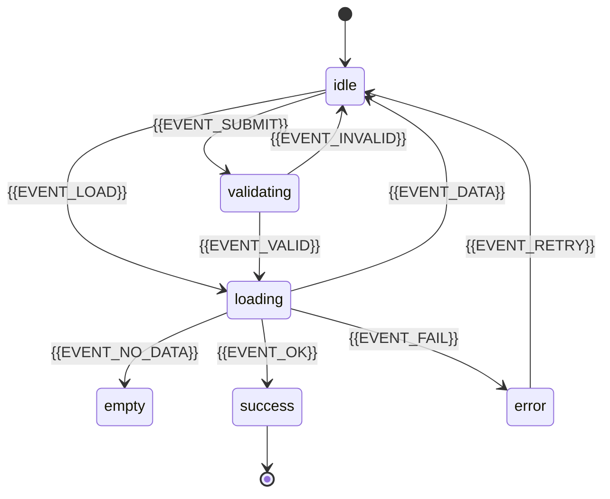

# {{UI_SPECS_TITLE}}

## Information architecture

{{IA_OVERVIEW_OR_SCREEN_MAP}}

## Screens

### {{SCREEN_NAME}}

| Element | Specification |
| --- | --- |
| Layout | {{LAYOUT_1}} |
| Content | {{CONTENT_1}} |

#### States

| State | Visible UI | Affordances |
| --- | --- | --- |
| idle | {{IDLE_UI}} | {{IDLE_AFFORDANCES}} |
| loading | {{LOADING_UI}} | {{LOADING_AFFORDANCES}} |
| empty | {{EMPTY_UI}} | {{EMPTY_AFFORDANCES}} |
| validating | {{VALIDATING_UI}} | {{VALIDATING_AFFORDANCES}} |
| success | {{SUCCESS_UI}} | {{SUCCESS_AFFORDANCES}} |
| error | {{ERROR_UI}} | {{ERROR_AFFORDANCES}} |

Omit rows that do not apply to this screen. Add rows for screen-specific states (e.g. `partial`, `stale`, `offline`).

#### Transitions

| From | Event | To | UI effect |
| --- | --- | --- | --- |
| {{FROM_1}} | {{EVENT_1}} | {{TO_1}} | {{EFFECT_1}} |

Omit the diagram when the transition table alone is clear (simple screens). Prefer one diagram per complex flow.

### Flow: {{FLOW_NAME}}

Use a **Flow** subsection when one interaction spans multiple screens or shared chrome (modals, steppers, global toasts). Same **States** and **Transitions** tables as a screen; name states so ownership is clear (e.g. `checkout/submitting`).

## Accessibility

- {{A11Y_STATE_RELATED_1}}

## Open questions

- {{QUESTION_1}}
