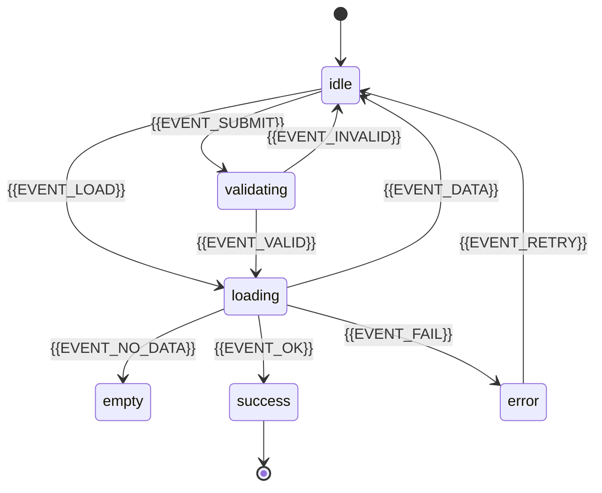

# {{UI_SPECS_TITLE}}

## Flow

```mermaid
flowchart LR
  {{SCREEN_A}} -->|{{NAV_EVENT_1}}| {{SCREEN_B}}
  {{SCREEN_B}} -->|{{NAV_EVENT_2}}| {{SCREEN_C}}
  {{SCREEN_C}} -->|Back| {{SCREEN_B}}
```

## Screens

### {{SCREEN_NAME}}

**Job:** {{SCREEN_JOB}}

#### UI structure

```
┌────────────────────────────────┐
│ {{ZONE_1}}                     │
├────────────────────────────────┤
│ {{ZONE_2}}                     │
├────────────────────────────────┤
│ {{ZONE_3}}                     │
└────────────────────────────────┘
```

- {{ZONE_1}}: {{FILL_1}}
- {{ZONE_2}}: {{FILL_2}}
- {{ZONE_3}}: {{FILL_3}}

#### States

| State | Composition change | Copy / sample |
| --- | --- | --- |
| idle | Canonical structure | — |
| loading | {{LOADING_CHANGE}} | {{LOADING_COPY}} |
| empty | {{EMPTY_CHANGE}} | {{EMPTY_COPY}} |
| validating | {{VALIDATING_CHANGE}} | {{VALIDATING_COPY}} |
| success | {{SUCCESS_CHANGE}} | {{SUCCESS_COPY}} |
| error | {{ERROR_CHANGE}} | {{ERROR_COPY}} |

#### Transitions

| From | Event | To | UI effect |
| --- | --- | --- | --- |
| {{FROM_1}} | {{EVENT_1}} | {{TO_1}} | {{EFFECT_1}} |


```mermaid
stateDiagram-v2
  [*] --> idle
  idle --> loading: {{EVENT_LOAD}}
  loading --> empty: {{EVENT_NO_DATA}}
  loading --> idle: {{EVENT_DATA}}
  idle --> validating: {{EVENT_SUBMIT}}
  validating --> idle: {{EVENT_INVALID}}
  validating --> loading: {{EVENT_VALID}}
  loading --> success: {{EVENT_OK}}
  loading --> error: {{EVENT_FAIL}}
  error --> idle: {{EVENT_RETRY}}
  success --> [*]
```

## Accessibility

- {{A11Y_STATE_RELATED_1}}

## Open questions

- {{QUESTION_1}}
