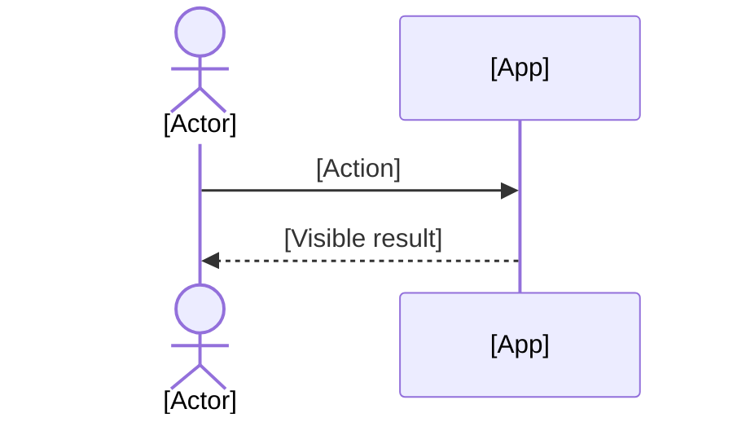

# [Title]

By the end, [what the user has done and seen].

## Before you start

- [What must already be true, in plain words, and the walkthrough that makes it true: "Needs [fact]: finish [Walkthrough](walkthrough-id.md) first." — or "Starts from [baseline title]." No commands.]
- [Who is signed in, on which surface]
- [Files to keep at hand — omit when none]

## Flow

## Steps

### [Actor title]

1. [One action] — click **[Exact label]**.
   - You should see: [something observable].
   - Why: [one or two sentences; link the spec section when there is one].
2. Type `[input]` in **[Field label]**, then click **[Exact label]**.
   - You should see: [something observable].

### [Other actor title]

3. [The next action continues the count].
   - You should see: [something observable].

## Cases

| Case | Do | You should see |
| --- | --- | --- |
| [Variant input] | [What differs] | [The one observable difference] |

## Try it yourself

- [An open-ended variation to explore]
