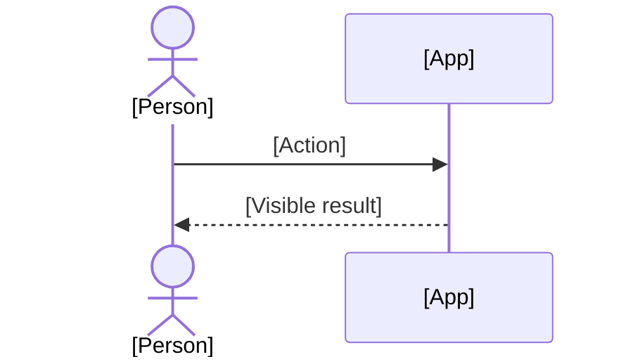

# [Title]

By the end, [what the user has done and seen].

## Before you start

- [Start from: the baseline command, or "finish [Walkthrough](walkthrough-id.md)"]
- [Who is logged in, on which surface]
- About [N] minutes

## Journey

## Steps

### [Actor]

1. [One action] — click **[Exact label]**.
   - You should see: [something observable].
   - Why: [one or two sentences; link the spec section when there is one].

## Cases

| Case | Do | You should see |
| --- | --- | --- |
| [Variant input] | [What differs] | [The one observable difference] |

## Try it yourself

- [An open-ended variation to explore]

## Something looks wrong?

Report it as `[Title] › step [N] › what you saw`.
